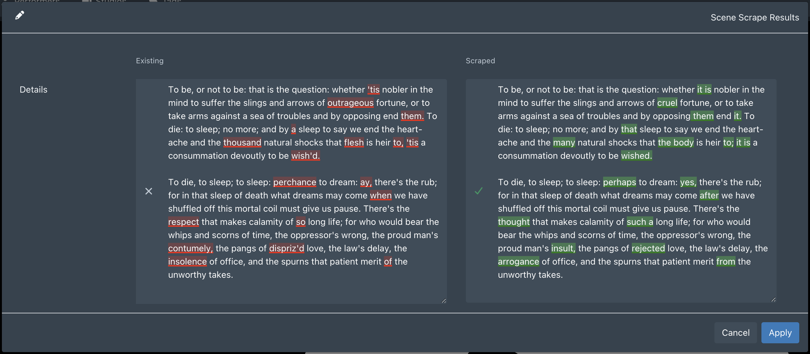

# ScrapeDiff

Renders a live word-level diff overlay on the Details/Synopsis field in Stash's scrape result modals, making it immediately clear what changed between your existing data and the scraped result.

## Features

- Word-level diff with red (removed) and green (added) highlights
- Targets the Details/Synopsis field across Scene, Gallery, Performer, and Group scrape modals — the one field long enough to actually need a diff
- Synchronized height resize — drag either textarea and the other follows
- Scroll-synced overlays
- Debounced live update as you edit the scraped field
- No external dependencies, no build step

## Installation

1. Download or clone this repository and copy the `ScrapeDiff` folder into your Stash plugins directory (default: `~/.stash/plugins/`)
2. Go to **Settings → Plugins** and click **Reload Plugins**
3. Enable **ScrapeDiff**

## Usage

Open any scrape result modal. The Details or Synopsis field will automatically display a diff between the existing value and the scraped value.

No configuration required.

## Notes

- Skips rendering when the existing field is empty (new data, nothing to diff against)
- Cleans up all event listeners and observers when the modal closes
